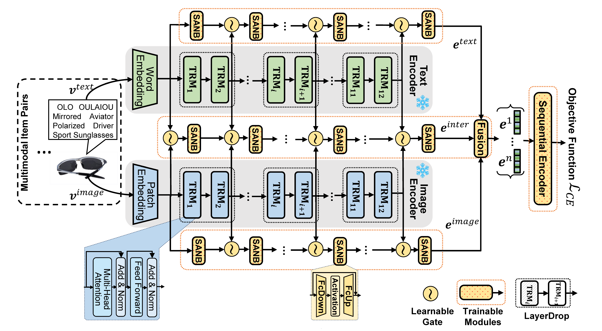
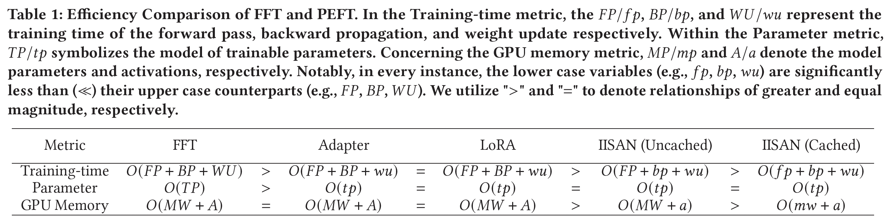
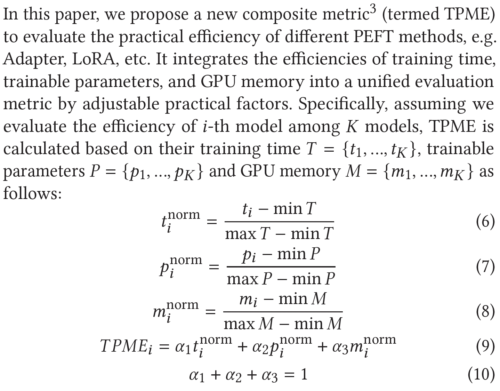

# IISAN: Efficiently Adapting Multimodal Representation for Sequential Recommendation with Decoupled PEFT (SIGIR2024)
<a href="https://arxiv.org/abs/2404.02059" alt="arXiv"></a>
 
 
 

We are currently organizing the codes and datasets. We plan to release all codes by **April 30, 2024.** If you are interested in adopting parameter-efficient fine-tuning (PEFT) in recommendation you can also refer to our previous WSDM 2024 paper: 
[Adapter4Rec](https://github.com/westlake-repl/Adapter4Rec)

### TODO list sorted by priority
* [x] Release the IISAN(Uncached)
* [x] Release baseline approaches
* [x] Release the IISAN(Cached)
--By April 30, 2024 (Completed early on April 15, 2024)
* [x] Release Datasets and IISAN(Cached)'s hidden states
* [ ] Combine Uncached and Cached IISAN in one framework
      

**If you encounter any questions or discover a bug within the paper or code, please do not hesitate to open an issue or submit a pull request.**

## Abstract
Multimodal foundation models are transformative in sequential recommender systems, leveraging powerful representation learning capabilities. While Parameter-efficient Fine-tuning (PEFT) is commonly used to adapt foundation models for recommendation tasks, most research prioritizes parameter efficiency, often overlooking critical factors like GPU memory efficiency and training speed. Addressing this gap, our paper introduces  IISAN (Intra- and Inter-modal Side Adapted Network for Multimodal Representation), a simple plug-and-play architecture using a Decoupled PEFT structure and exploiting both intra- and inter-modal adaptation. 

IISAN matches the performance of full fine-tuning (FFT) and state-of-the-art PEFT. More importantly, it significantly reduces GPU memory usage — from 47GB to just 3GB for multimodal sequential recommendation tasks.  Additionally, it accelerates training time per epoch from 443s to 22s compared to FFT. This is also a notable improvement over the Adapter and LoRA, which require 37-39 GB GPU memory and 350-380 seconds per epoch for training. 

Furthermore, we propose a new composite efficiency metric, TPME (Training-time, Parameter, and GPU Memory Efficiency) to alleviate the prevalent misconception that "parameter efficiency represents overall efficiency". TPME provides more comprehensive insights into practical efficiency comparisons between different methods. Besides, we give an accessible efficiency analysis of all PEFT and FFT approaches, which demonstrate the superiority of IISAN.

 

## Experiment Setup
```
conda create -n iisan python=3.8

conda activate iisan

pip install torch==1.13.0 torchvision==0.14.0 torchaudio==0.13.0 loralib==0.1.1 transformers==4.20.1 lmdb
```
## Preparation
The complete textual recommendation datasets are available under the Dataset directory. 

Download the image files:

"am_image_is.zip" for Scientific dataset from this [link](https://drive.google.com/file/d/1vXLls-2DvvkMfgiCv3nB8C29nu0NDdt3/view?usp=sharing)

"am_image_mi.zip" for Instruments dataset from this [link](https://drive.google.com/file/d/1icKbl3ltN28WDESSKOdhOA0pNWIiNxe0/view?usp=sharing)

"am_image_op.zip" for Office dataset from this [link](https://drive.google.com/file/d/1zl-RbSNwUmQicCB3w1xY9RQWN8vGg5pC/view?usp=sharing)

You should unzip these zip files under "Dataset/". Then run the following to get the lmdb files:
```
cd Dataset/
python build_lmdb.py
```


## Training & Testing for IISAN(Uncached)
```
cd Code_Uncached/scripts/
python run_IISAN.py
```
## Training & Testing for IISAN(Cached) 
**Note: Theoretically, IISAN(Cached) will only improve the training efficiency and maintain the original performance of IISAN(Uncached).**
```
cd Code_Cached/
python preprocess_vectors.py

cd scripts/
python run_IISAN.py
```

## Efficiency Analysis
 

## New Efficiency Metric - TPME (Training-time, Parameter, GPU Memory Efficiency)
<p align="center" width="100%">

</p>

where $\alpha$ denotes the weighting assigned to each term, tailored to specific circumstances. For example, in scenarios where only a limited GPU capacity is available for model training, it's advisable to significantly augment the weight of $M$. Within the scope of this paper, we've adjusted the values of $\alpha_1$ and $\alpha_3$ to 0.45, and $\alpha_2$ to 0.1. This adjustment reflects our focus on two key practical aspects: training speed and memory efficiency.
